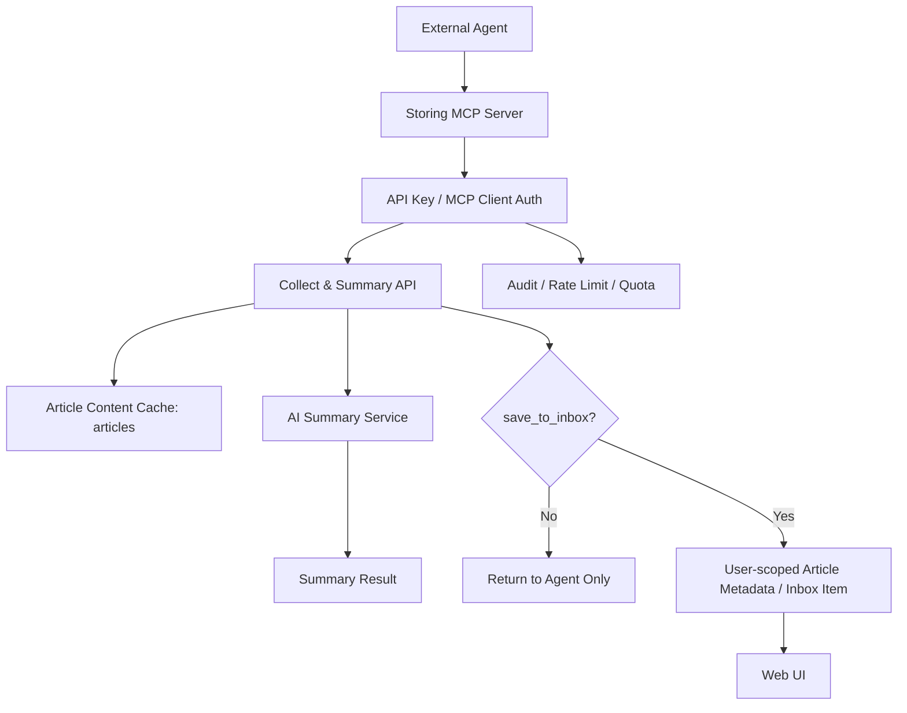

# Storing — MCP 对外智能摘要服务改造方案书

**产品名称：** Storing MCP Summary Service  
**文档版本：** v1.0  
**最后更新：** 2026-07-14  
**文档状态：** 方案草案  
**适用范围：** Storing 现有稍后阅读平台、未来 MCP/API 对外摘要能力、多用户/多 Agent 数据隔离

---

## 1. 背景与目标

### 1.1 背景

Storing 当前定位是 AI 驱动的个人稍后阅读平台，核心能力包括链接采集、AI 摘要、智能分类、自动标签、归档和知识库沉淀。

新的需求是：

> 允许外部 Agent 通过 MCP 调用 Storing 的采集与摘要能力，发送文章链接到平台，平台完成网页抓取和智能总结后，把结果返回给 Agent。

该能力有两个潜在使用形态：

1. **摘要工具形态**：Agent 只是临时请求总结一篇文章，不希望污染用户自己的稍后阅读收件箱。
2. **代收藏形态**：Agent 代表某个用户把链接保存到 Storing，后续用户可以在网页端继续阅读、归档、搜索。

当前系统更接近单用户产品，`articles` 和 `article_metadata` 的数据边界不足以支撑对外开放。如果直接把现有 `/collect` 暴露给 MCP，会造成外部请求大量进入个人业务流，污染用户自己的收件箱、归档、搜索和 Wiki。

### 1.2 目标

本次改造的目标是：

- 为 Agent 提供稳定的 MCP 智能摘要入口。
- 区分网页端用户操作、MCP 调用、API 调用等不同来源。
- 避免外部 Agent 请求污染用户个人收件箱。
- 支持未来“谁发的链接进入谁的收件箱”。
- 为后续多用户、API Key、配额、审计和对外开放打基础。

### 1.3 非目标

第一阶段不追求完整 SaaS 化，不一次性实现完整的用户注册、计费、组织管理、公开开放平台。

第一阶段也不建议直接开放匿名 MCP 服务。所有 MCP 调用都应具备可识别身份。

---

## 2. 当前系统问题分析

### 2.1 当前核心数据结构

当前系统主要表结构如下：

- `users`：管理员账号，当前偏单用户。
- `articles`：全局文章表，存储原始文章内容，按 URL 去重。
- `article_metadata`：文章业务状态和 AI 结果，当前 `article_id` 唯一。
- `collect_jobs`：链接采集任务，当前没有用户归属。

### 2.2 关键问题

#### 问题一：采集任务没有请求归属

`collect_jobs` 当前没有：

- `user_id`
- `client_id`
- `request_source`
- `save_to_inbox`

因此无法判断一个采集任务来自网页端、MCP，还是未来 API，也无法定位是谁提交的请求。

#### 问题二：文章状态没有用户维度

当前 `article_metadata.article_id` 是唯一的，一篇文章只有一份收藏、归档、摘要、标签状态。

这会导致：

- 不同用户无法独立收藏同一篇文章。
- 外部 Agent 可能影响用户自己的文章状态。
- “谁发的进入谁的收件箱”无法自然实现。

#### 问题三：MCP 和网页端混用同一业务入口风险较高

现有 `/collect` 是面向网页端用户的收藏/采集入口。直接开放给 MCP 会导致：

- 外部请求默认进入业务列表。
- 无法按调用方限流。
- 无法做 API Key 级审计。
- 无法区分只摘要请求和收藏请求。
- 垃圾链接难以清理。

---

## 3. 设计原则

### 3.1 内容缓存与用户状态分离

推荐将系统理解为两层：

1. **文章内容层**：全局缓存网页抓取结果，避免重复抓取。
2. **用户状态层**：记录某个用户是否收藏、是否归档、是否由 MCP 提交、是否进入收件箱。

因此：

- `articles` 可以继续作为全局内容缓存。
- `article_metadata` 需要演进为用户维度状态。

### 3.2 MCP 默认只摘要，不入库

对外 Agent 的最常见诉求是“帮我看一下这个链接讲什么”。因此 MCP 工具默认不应把文章放入用户个人收件箱。

默认策略：

```txt
summarize_url(url) => 返回摘要，不进入收件箱
collect_url(url)   => 明确收藏，进入当前 API Key 对应用户的收件箱
```

### 3.3 每次外部调用必须可归因

所有 MCP/API 请求都必须可以追踪到：

- 哪个 API Key / MCP client 发起。
- 归属于哪个用户。
- 使用了什么权限。
- 是否保存到 inbox。
- 请求是否成功、失败、耗时和消耗。

### 3.4 权限控制应绑定 MCP client，而不是网页登录 JWT

网页 JWT 用于用户登录态，不适合发给外部 Agent 长期保存。

MCP/API 调用应使用独立的 API Key，并映射到 `mcp_clients`。

---

## 4. 总体架构

### 4.1 目标架构图



### 4.2 核心对象

| 对象 | 说明 |
|------|------|
| User | 平台用户，可拥有自己的收件箱、归档、收藏和 MCP client |
| MCP Client | 供 Agent 使用的调用身份，持有 API Key、权限和配额 |
| Article | 全局文章内容缓存，同一 URL 可复用 |
| Article Metadata | 用户维度的文章业务状态和 AI 结果 |
| Collect Job | 一次采集/总结任务，记录来源、状态和结果 |
| Summary Request | 可选的临时摘要请求记录，用于审计和短期缓存 |

---

## 5. 数据模型改造方案

### 5.1 `users` 表增强

当前用户表可以保留，增加角色字段：

```txt
users
- id
- username
- password_hash
- role              admin / user / service
- status            active / disabled
- created_at
- updated_at
```

角色说明：

| role | 说明 |
|------|------|
| admin | 平台管理员，即当前个人主账号 |
| user | 普通用户，未来对外开放时使用 |
| service | 服务账号，例如公共 MCP bot 或内部系统账号 |

### 5.2 新增 `mcp_clients`

```txt
mcp_clients
- id
- name
- owner_user_id
- api_key_hash
- role
- scopes
- enabled
- rate_limit_per_minute
- rate_limit_per_day
- default_save_to_inbox
- created_at
- updated_at
- last_used_at
```

推荐 scopes：

```txt
summary:create       允许创建临时摘要
collect:create       允许提交采集任务
inbox:write          允许写入 owner 用户收件箱
article:read:self    允许读取自己提交/拥有的文章结果
job:read:self        允许查询自己提交的任务状态
```

### 5.3 `collect_jobs` 增加归属字段

```txt
collect_jobs
- id
- url
- normalized_url
- user_id
- client_id
- request_source       web / mcp / api / system
- save_to_inbox
- status
- stage
- method
- capture_strategy
- article_id
- title
- error
- created_at
- updated_at
- started_at
- finished_at
```

字段含义：

| 字段 | 说明 |
|------|------|
| user_id | 请求归属用户。网页端为当前登录用户，MCP 为 client.owner_user_id |
| client_id | MCP/API 调用身份，网页端可为空 |
| request_source | 请求来源，便于过滤和审计 |
| save_to_inbox | 是否进入用户收件箱/归档体系 |

### 5.4 `article_metadata` 用户维度改造

当前：

```txt
article_metadata.article_id unique
```

建议改为：

```txt
article_metadata
- id
- user_id
- article_id
- source_type       web / mcp / api / system
- client_id
- is_favorited
- is_archived
- ai_summary
- ai_category
- ai_tags
- content_md
- content_html
- content_html_mobile
- cover_image
- favorited_at
- archived_at
- created_at
- updated_at

unique(user_id, article_id)
```

这样同一篇文章可以同时存在于不同用户空间中，且状态互不影响。

### 5.5 可选新增 `summary_requests`

如果希望临时摘要不污染 `article_metadata`，可以增加独立请求记录表：

```txt
summary_requests
- id
- user_id
- client_id
- article_id
- url
- normalized_url
- status
- summary
- category
- tags
- error
- expires_at
- created_at
- updated_at
```

第一阶段可以不新增该表，先复用 `collect_jobs` + `articles` + 返回结果；第二阶段再引入 TTL 型临时摘要表。

---

## 6. MCP/API 能力设计

### 6.1 工具一：`summarize_url`

用于 Agent 发送链接并获取摘要。默认不保存到用户收件箱。

输入：

```json
{
  "url": "https://example.com/article",
  "language": "zh-CN",
  "summary_style": "brief",
  "save_to_inbox": false
}
```

输出，同步完成时：

```json
{
  "status": "completed",
  "article_id": 123,
  "title": "文章标题",
  "summary": "摘要内容",
  "category": "技术",
  "tags": ["AI", "Agent", "MCP"],
  "saved_to_inbox": false
}
```

输出，异步处理中：

```json
{
  "status": "running",
  "job_id": 456,
  "message": "文章正在抓取和总结，请稍后查询任务状态"
}
```

权限要求：

```txt
summary:create
```

### 6.2 工具二：`get_collect_status`

用于 Agent 轮询任务状态。

输入：

```json
{
  "job_id": 456
}
```

输出：

```json
{
  "status": "completed",
  "article_id": 123,
  "title": "文章标题",
  "summary": "摘要内容",
  "category": "技术",
  "tags": ["AI", "Agent"],
  "saved_to_inbox": false
}
```

权限要求：

```txt
job:read:self
```

### 6.3 工具三：`collect_url`

明确表示“保存到当前调用身份对应用户的收件箱”。

输入：

```json
{
  "url": "https://example.com/article",
  "inbox": "default"
}
```

输出：

```json
{
  "status": "completed",
  "article_id": 123,
  "title": "文章标题",
  "summary": "摘要内容",
  "saved_to_inbox": true
}
```

权限要求：

```txt
collect:create
inbox:write
```

---

## 7. 数据隔离策略

### 7.1 默认视图隔离

网页端文章列表、搜索、收藏、归档都应基于当前用户过滤：

```sql
where article_metadata.user_id = current_user.id
```

游客或公开视图不应看到其他用户私有数据。

### 7.2 来源隔离

所有入库记录应带来源：

```txt
source_type = web / mcp / api / system
client_id = nullable
```

UI 可支持过滤：

- 全部
- 手动收藏
- MCP 收藏
- API 收藏

默认首页优先展示用户自己的手动收藏和待处理内容，避免服务型请求干扰。

### 7.3 服务账号隔离

第一阶段可创建服务账号：

```txt
username: mcp-bot
role: service
```

外部 demo client 绑定到 `mcp-bot`，默认 `save_to_inbox=false`。这样即使需要保留临时记录，也不会污染 admin 的个人业务流。

---

## 8. 防滥用与安全策略

### 8.1 认证

不开放匿名 MCP。每个外部 Agent 使用独立 API Key。

API Key 只展示一次，数据库保存 hash。

### 8.2 授权

所有工具调用检查 scope：

| 操作 | 必需 scope |
|------|------------|
| 临时摘要 | `summary:create` |
| 查询任务 | `job:read:self` |
| 保存到收件箱 | `collect:create` + `inbox:write` |
| 读取文章结果 | `article:read:self` |

### 8.3 限流

建议按 client 维度限制：

- 每分钟请求数
- 每日请求数
- 并发采集数
- 单 URL 重复提交冷却时间

### 8.4 URL 安全

必须继续强化采集 URL 安全：

- 仅允许 http/https。
- 禁止 localhost、127.0.0.1、内网 IP、metadata IP。
- 限制跳转次数。
- 限制响应体大小。
- 限制抓取耗时。
- 支持域名黑名单。

### 8.5 数据保留

建议策略：

| 数据 | 保留策略 |
|------|----------|
| 已保存到用户 inbox 的文章 | 长期保留 |
| 临时摘要请求 | 7-30 天 |
| 失败任务 | 30 天 |
| API 调用日志 | 30-90 天 |

---

## 9. 分阶段落地路线

### 阶段 1：内部 MCP MVP

目标：先让自己的 Agent 可以通过 MCP 发送链接并拿到摘要，且不污染个人收件箱。

范围：

- 新增 `mcp_clients`。
- 新增 API Key 验证中间件。
- `collect_jobs` 增加归属字段。
- MCP 工具：`summarize_url`、`get_collect_status`。
- 默认 `save_to_inbox=false`。
- 创建 `mcp-bot` 服务账号或绑定 admin 的私有 client。

不做：

- 完整用户注册。
- UI 管理 API Key。
- 完整多用户 article_metadata 改造。

### 阶段 2：用户级收件箱隔离

目标：支持“谁发的就进谁的收件箱”。

范围：

- `article_metadata` 增加 `user_id`。
- unique 从 `article_id` 改为 `user_id + article_id`。
- 迁移旧数据归属到 admin。
- `/articles`、`/search`、收藏、归档、详情接口按 user 过滤。
- MCP `collect_url` 支持保存到 owner 用户 inbox。

### 阶段 3：对外开放准备

目标：可控开放给其他人或其他 Agent。

范围：

- API Key 管理界面。
- client 配额管理。
- 审计日志。
- 滥用监控。
- 用户管理。
- 临时摘要 TTL 清理。
- MCP 文档和接入示例。

---

## 10. 关键决策建议

### 10.1 是否使用新账号角色？

建议使用，但只作为隔离手段之一。

推荐：

- 创建 `service` 角色。
- 创建 `mcp-bot` 服务账号。
- 第一阶段外部 demo client 绑定到 `mcp-bot`。
- 私人 agent 可绑定到 admin，但默认仍然不保存。

### 10.2 是否默认保存到收件箱？

不建议。

默认应为：

```txt
summarize_url.save_to_inbox = false
```

只有明确调用 `collect_url`，或 `save_to_inbox=true` 且 client 有 `inbox:write` 权限时，才写入用户收件箱。

### 10.3 是否需要马上做完整多用户？

不需要。

建议先完成内部 MCP MVP，验证体验后再做 `article_metadata.user_id` 的较大迁移。

---

## 11. 成功标准

第一阶段成功标准：

- Agent 可以通过 MCP 提交链接并拿到摘要。
- MCP 请求能被识别为具体 client。
- MCP 请求默认不出现在 admin 的个人收件箱。
- 可以查询任务状态。
- 可以按 client 查看最近请求和失败原因。

第二阶段成功标准：

- 同一篇文章可被不同用户独立收藏和归档。
- 用户 A 的请求不会出现在用户 B 的列表中。
- MCP client 保存内容时进入 owner 用户空间。
- 现有 admin 历史数据迁移后不丢失。

第三阶段成功标准：

- 可以安全发放、禁用、轮换 API Key。
- 可以按 client 限流和审计。
- 有明确接入文档和错误码。
- 外部 Agent 使用不会污染个人业务流。
