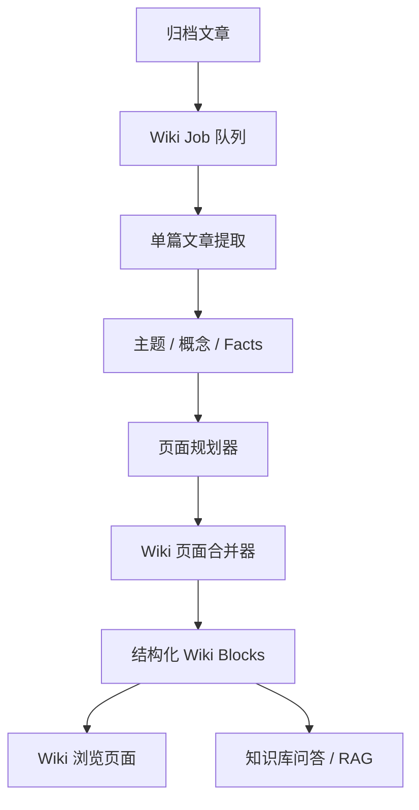

# Storing — LLM Wiki 自动知识库

**产品名称：** Storing LLM Wiki  
**文档版本：** v1.0  
**最后更新：** 2026-06-23  
**文档状态：** 需求草案  

---

## 1. 产品概述

### 1.1 产品定位

LLM Wiki 是 Storing 面向归档文章的自动知识沉淀系统。系统基于用户已经归档的全部文章，使用大模型持续阅读、抽取、归纳和重写内容，自动生成可浏览、可追溯、可问答的个人 Wiki。

该功能不是简单的文章搜索或临时 RAG 问答，而是将归档文章编译成一个持久化的二次知识层：文章是原始资料，Wiki 是由原始资料持续维护出的结构化知识库。

### 1.2 核心价值

| 用户痛点 | 解决方案 |
|---------|---------|
| 归档文章越来越多，回看成本高 | 自动把归档内容整理为主题 Wiki 页面 |
| 文章之间的关系难以发现 | 自动抽取主题、概念、实体和页面链接 |
| 搜索只能找到原文，不能形成知识体系 | Wiki 页面提供归纳后的结构化知识 |
| 担心 AI 幻觉 | Wiki 内容必须可追溯到来源文章 |
| 希望后续能问自己的知识库 | Wiki 页面和 block 可作为问答/RAG 的高质量语料 |

### 1.3 目标用户

- 每天归档大量文章的知识工作者
- 希望从稍后阅读工具中沉淀长期知识的人
- 希望后续围绕个人资料库进行问答、复盘、专题研究的用户

---

## 2. 需求范围

### 2.1 进入 Wiki 的内容范围

所有当前处于“已归档”状态的文章都应进入 Wiki 编译范围，不限制文章领域。

包括但不限于：

- 技术文章
- 产品/商业文章
- AI 工具与教程
- 旅游、生活、消费类文章
- 新闻资讯
- 经验分享
- 资料索引

系统需要根据文章的长期知识价值进行不同层级处理：

- 高知识密度内容：生成或更新主题页/概念页
- 中等价值内容：归入已有主题页的案例、资料或背景段落
- 低长期价值内容：进入资料索引页或来源集合页，避免污染核心 Wiki 页面

### 2.2 Wiki 维护方式

Wiki 由系统全自动维护，默认不提供用户手动编辑正文。

用户可以手动触发以下维护动作：

- 更新知识库
- 重建当前 Wiki 页面
- 重新编译单篇文章
- 重新索引全部归档文章
- 全量重建 Wiki

手动操作是触发系统重新生成，而不是直接编辑 Wiki 内容。

### 2.3 后续问答

后续需要支持“向知识库提问”。

第一阶段可以先完成 Wiki 生成和来源追踪；第二阶段基于 Wiki 页面、Wiki blocks、文章抽取结果和原文内容建立问答能力。

---

## 3. 产品形态

### 3.1 新增一级页面：知识库 / Wiki

导航中新增 Wiki 入口。页面用于展示自动生成的个人知识库。

建议页面结构：

- Wiki 首页
- 主题页面列表
- 最近更新页面
- 生成状态面板
- 知识库搜索
- 后续知识库问答入口

### 3.2 Wiki 首页

Wiki 首页展示整体知识库概况。

核心内容：

- 自动生成的知识地图
- 主题目录
- 最近更新的 Wiki 页面
- 最近进入 Wiki 的归档文章
- Wiki 编译状态
- 手动更新入口

示例信息：

> 由 136 篇归档文章整理而成，最近更新于 2026-06-23。

### 3.3 Wiki 主题页

主题页是核心知识承载单元。它不是单篇文章的复刻，而是多篇归档文章的归纳结果。

页面内容建议：

- 标题
- 简介
- 核心要点
- 详细说明
- 相关概念
- 相关 Wiki 页面
- 来源文章列表
- 最近更新时间
- 页面版本信息

### 3.4 文章反链

在文章详情页增加 Wiki 关联信息。

示例：

- 已加入 Wiki
- 贡献到以下页面：
  - NAS 自动化
  - 订阅管理
  - 本地服务部署

如果文章尚未被编译，则展示：

- 等待加入 Wiki
- Wiki 编译失败
- 重新编译按钮

---

## 4. 文档存储形态

### 4.1 Markdown 与结构化文档区别

Markdown 是线性文本格式，适合导出和展示，但结构语义较弱。

示例：

```md
# NAS 自动化

## 核心要点

- 可以通过本地服务记录订阅续费周期。
- 可以使用 Docker 部署提醒服务。
```

Notion/飞书风格的结构化文档是 block-based document。页面由多个 block 组成，每个 block 有明确类型和元数据。

示例：

```json
{
  "title": "NAS 自动化与订阅管理",
  "blocks": [
    {
      "type": "summary",
      "text": "这一主题整理了 NAS 上的订阅管理、自动化脚本和本地服务部署经验。"
    },
    {
      "type": "heading",
      "level": 2,
      "text": "核心做法"
    },
    {
      "type": "bullet_list",
      "items": [
        {
          "text": "通过本地服务统一管理订阅续费提醒。",
          "sources": [123, 456]
        }
      ]
    },
    {
      "type": "source_list",
      "articleIds": [123, 456, 789]
    }
  ]
}
```

### 4.2 推荐方案

存储层使用结构化 blocks，展示层渲染为类 Notion/飞书文档，导出时可转 Markdown。

优势：

- 支持 block 级来源引用
- 支持局部重写
- 支持版本 diff
- 支持后续问答时按 block 检索
- 支持折叠块、引用块、表格、callout 等更丰富 UI

---

## 5. 核心流程

### 5.1 总体流程



### 5.2 两阶段生成策略

Wiki 编译采用“先抽取，后合并”的两阶段策略。

#### 阶段一：单篇文章抽取

LLM 阅读单篇归档文章，产出稳定 JSON。

内容包括：

- 文章摘要
- 核心事实
- 关键概念
- 实体
- 标签
- 可能归属主题
- 建议创建或更新的 Wiki 页面
- 可引用的证据片段

示例：

```json
{
  "summary": "本文介绍了在 NAS 上搭建订阅续费提醒系统的实践。",
  "topics": ["NAS", "订阅管理", "自动化提醒"],
  "entities": ["Docker", "NAS", "订阅服务"],
  "facts": [
    {
      "claim": "可以通过本地服务记录订阅续费周期并提前提醒。",
      "evidence": "原文中的对应片段",
      "confidence": 0.86
    }
  ],
  "suggestedPages": [
    "NAS 自动化",
    "订阅管理"
  ]
}
```

#### 阶段二：Wiki 页面合并

页面合并器基于多个文章抽取结果更新 Wiki 页面。

要求：

- 去重
- 合并相似观点
- 按主题重组结构
- 保留来源引用
- 生成内部链接
- 不写无来源支撑的事实
- 保存页面版本

---

## 6. 生命周期与触发机制

### 6.1 文章状态

每篇归档文章在 Wiki 系统中有独立状态。

建议状态：

- `pending`：等待编译
- `extracting`：正在提取
- `indexed`：已进入 Wiki
- `stale`：文章内容、归档状态或来源关系变化，需要重新处理
- `removed`：不再参与 Wiki
- `failed`：处理失败

### 6.2 自动触发

#### 文章归档时

当文章被归档：

1. 标记该文章进入 Wiki 编译范围
2. 创建 `extract_article` 任务
3. 任务异步执行，不阻塞归档操作
4. 成功后创建或更新相关 Wiki 页面任务

#### 取消归档时

当文章取消归档：

1. 将该文章的 Wiki contribution 标记为 inactive
2. 找到它影响过的 Wiki 页面
3. 创建 `reconcile_pages` 任务
4. 受影响页面重新合并
5. 如果页面没有任何有效来源，则自动隐藏或删除

默认策略：严格模式。只有当前归档内容参与 Wiki。

#### 删除文章时

当文章被删除：

1. 相关 Wiki contribution 必须失效
2. 删除或失效对应来源引用
3. 创建受影响页面的重新合并任务
4. 如果 Wiki 页面无有效来源，则自动删除或转为失效页面
5. 页面版本记录保留，便于审计和回滚

### 6.3 定时触发

建议每天凌晨执行一次兜底同步。

处理内容：

- 漏掉的归档文章
- 卡住的任务
- 失败可重试任务
- 状态不一致的页面来源关系

### 6.4 手动触发

必须支持手动触发。

入口：

- Wiki 首页：更新知识库
- Wiki 页面：重新生成本页
- 文章详情页：重新编译到 Wiki
- 设置页：重新索引所有归档文章 / 全量重建 Wiki

手动触发分级：

| 操作 | 说明 | 风险 |
|------|------|------|
| 更新增量 | 只处理 pending/stale/failed 任务 | 低 |
| 重建当前页面 | 只重建当前 Wiki 页面 | 中 |
| 重新编译单篇文章 | 重新做文章抽取并更新相关页面 | 中 |
| 重新索引全部归档文章 | 重做所有文章抽取 | 高 |
| 全量重建 Wiki | 清空并重建全部 Wiki 页面 | 高 |

高风险操作需要二次确认。

---

## 7. 数据模型建议

### 7.1 wiki_articles

记录文章在 Wiki 系统中的状态。

字段建议：

- `id`
- `article_id`
- `status`
- `content_hash`
- `last_indexed_at`
- `last_error`
- `created_at`
- `updated_at`

### 7.2 wiki_article_extracts

存储单篇文章的结构化抽取结果。

字段建议：

- `id`
- `article_id`
- `model_provider`
- `model_name`
- `summary`
- `topics`
- `entities`
- `facts`
- `suggested_pages`
- `source_quotes`
- `created_at`
- `updated_at`

### 7.3 wiki_pages

存储 Wiki 页面主体。

字段建议：

- `id`
- `title`
- `slug`
- `page_type`
- `summary`
- `blocks`
- `status`
- `version`
- `last_generated_at`
- `created_at`
- `updated_at`

页面类型建议：

- `topic`
- `concept`
- `index`
- `collection`

### 7.4 wiki_page_sources

存储 Wiki 页面与文章之间的来源关系。

字段建议：

- `id`
- `page_id`
- `article_id`
- `contribution_type`
- `source_block_ids`
- `active`
- `created_at`
- `updated_at`

### 7.5 wiki_links

存储页面之间的内部链接。

字段建议：

- `id`
- `from_page_id`
- `to_page_id`
- `link_type`
- `created_at`

### 7.6 wiki_page_versions

存储页面历史版本。

字段建议：

- `id`
- `page_id`
- `version`
- `summary`
- `blocks`
- `source_article_ids`
- `model_provider`
- `model_name`
- `created_at`

### 7.7 wiki_jobs

后台任务队列。

字段建议：

- `id`
- `job_type`
- `status`
- `payload`
- `priority`
- `attempts`
- `max_attempts`
- `last_error`
- `scheduled_at`
- `started_at`
- `finished_at`
- `created_at`
- `updated_at`

任务类型建议：

- `extract_article`
- `merge_page`
- `reconcile_pages`
- `reindex_article`
- `reindex_all`
- `rebuild_page`
- `rebuild_all`

### 7.8 wiki_embeddings（第二阶段）

用于知识库问答。

字段建议：

- `id`
- `target_type`
- `target_id`
- `page_id`
- `block_id`
- `article_id`
- `embedding`
- `text`
- `metadata`
- `created_at`

---

## 8. AI 模型与 Provider

### 8.1 Provider 支持

Wiki 编译模型需要支持多个 provider。

第一版可复用现有 AI provider 抽象，后续增加 Wiki 独立配置。

需要支持：

- DeepSeek
- 火山方舟 / 豆包
- 阿里通义
- 腾讯混元
- 智普 GLM
- OpenRouter
- OpenAI-compatible custom endpoint

### 8.2 推荐配置

前期默认使用：

```bash
WIKI_AI_PROVIDER=deepseek
WIKI_AI_MODEL=deepseek-v4-flash
```

后续可接入 coding plan 中的模型，降低批量编译成本。

### 8.3 成本控制

即使模型成本较低，也需要控制批量任务。

策略：

- 每批最多处理 N 篇文章
- 每个任务有 token 上限
- 长文章先压缩成 extract，再进入页面合并
- `content_hash` 不变则不重复编译
- 页面只在关联 extract 变化时重建
- 失败任务限制重试次数

---

## 9. 知识库问答规划

### 9.1 问答目标

用户可以向自己的 Wiki 提问，系统基于 Wiki 页面、block、来源文章回答问题。

要求：

- 回答必须引用来源
- 优先基于 Wiki 页面回答
- 必要时回溯到原始文章
- 能跳转到相关 Wiki 页面或原文

### 9.2 检索优先级

建议顺序：

1. Wiki blocks
2. Wiki 页面摘要
3. 文章 extracts
4. 原文片段

这样可以优先使用已经整理过的知识层，而不是每次都从原文碎片重新推理。

### 9.3 第二阶段能力

- 向知识库提问
- 引用来源展示
- 相关页面推荐
- 问答历史
- 从回答跳转到 Wiki 页面或原文位置

---

## 10. 防幻觉与质量控制

### 10.1 基本原则

Wiki 内容必须来自归档文章。

禁止：

- 无来源事实
- 模型凭空补充资料
- 使用外部知识扩写为事实
- 删除仍有来源支撑的重要信息

允许：

- 对来源内容做总结
- 对多篇文章做归纳
- 明确标注“不确定”或“待确认”
- 将低置信度内容放入待确认区

### 10.2 来源追踪

每个重要结论应能追溯到来源文章。

页面至少需要展示：

- 来源文章列表
- 每个 block 或要点关联的来源文章
- 来源是否仍然有效

### 10.3 版本与回滚

每次 Wiki 页面重建都生成版本记录。

用户后续应能：

- 查看页面历史版本
- 比较版本变化
- 回滚到旧版本

第一版可以先存版本，UI 后续再补。

---

## 11. MVP 范围

### 11.1 MVP 必做

- 新增 Wiki 一级入口
- 支持手动“更新知识库”
- 处理所有已归档文章
- 单篇文章结构化抽取
- 自动生成 Wiki 主题页
- Wiki 页面展示来源文章
- 文章详情页展示 Wiki 状态
- 取消归档/删除后自动 reconcile
- 任务状态与失败重试
- 保存 Wiki 页面版本

### 11.2 MVP 暂不做

- 用户手动编辑 Wiki 正文
- 复杂知识图谱可视化
- 页面版本 diff UI
- 完整知识库问答
- block 级向量问答
- 多人协作

### 11.3 第二阶段

- 知识库问答
- Wiki blocks embedding
- 引用跳转到原文位置
- 页面版本 diff 和回滚 UI
- 主题图谱
- 更细粒度的 block 级更新

---

## 12. 页面与交互需求

### 12.1 Wiki 首页

功能：

- 展示知识库概况
- 展示主题页面
- 展示最近更新
- 展示任务状态
- 提供更新知识库按钮

验收标准：

- 用户能看到 Wiki 由多少篇归档文章生成
- 用户能看到最近更新时间
- 用户能手动触发增量更新
- 用户能进入具体 Wiki 页面

### 12.2 Wiki 页面

功能：

- 展示结构化 Wiki 内容
- 展示来源文章
- 展示相关页面
- 支持重新生成本页

验收标准：

- 页面内容按 block 渲染
- 来源文章可点击打开
- 页面更新时间清晰可见
- 重建本页不影响其它页面

### 12.3 文章详情页

功能：

- 展示 Wiki 编译状态
- 展示贡献到的 Wiki 页面
- 支持重新编译该文章

验收标准：

- 已归档文章能看到 Wiki 状态
- 未完成任务能看到处理中状态
- 编译失败能看到失败提示和重试入口

### 12.4 设置页或管理入口

功能：

- 配置 Wiki AI provider
- 查看任务队列
- 全量重建
- 重新索引全部归档文章

验收标准：

- 高风险操作需要确认
- 任务失败时能看到错误摘要
- 支持手动重试失败任务

---

## 13. 异常处理

### 13.1 LLM 调用失败

处理：

- 标记任务失败
- 记录错误
- 支持重试
- 不影响已有 Wiki 页面

### 13.2 JSON 解析失败

处理：

- 重试一次
- 使用严格 JSON schema 纠错
- 仍失败则标记 failed

### 13.3 页面合并失败

处理：

- 保留旧版本
- 不覆盖当前页面
- 记录失败任务

### 13.4 来源文章缺失

处理：

- 标记来源 inactive
- 触发页面 reconcile
- 移除无效引用

---

## 14. 非功能需求

### 14.1 性能

- 归档操作不能被 Wiki 编译阻塞
- Wiki 任务异步执行
- 页面列表分页加载
- 大量 Wiki 页面时支持搜索和筛选

### 14.2 可维护性

- LLM 输出必须 schema 化
- 任务可观察、可重试
- 页面版本可追踪
- Provider 与模型配置可扩展

### 14.3 安全性

- 只处理当前用户有权限访问的文章
- 删除文章后不得继续展示其原文引用
- 不把未归档文章纳入 Wiki

---

## 15. 开发拆分建议

### Phase 1：数据结构与任务队列

- 新增 Wiki 数据表
- 新增任务队列
- 实现归档/取消归档/删除的任务触发
- 实现任务状态 API

### Phase 2：文章抽取

- 实现单篇文章结构化抽取
- 存储 extract
- 支持失败重试
- 支持手动重新编译单篇文章

### Phase 3：页面生成与合并

- 实现页面规划器
- 实现 Wiki 页面合并器
- 保存 blocks 和版本
- 建立 page-source 关系

### Phase 4：Wiki UI

- 新增 Wiki 首页
- 新增 Wiki 页面详情
- 文章详情页展示 Wiki 状态
- 管理入口支持手动更新

### Phase 5：知识库问答

- 增加 embedding
- 实现 Wiki 检索
- 实现问答接口
- UI 展示回答和引用来源

---

## 16. 关键验收标准

- 已归档文章可以被加入 Wiki 编译队列
- 系统可以自动生成至少一个 Wiki 页面
- Wiki 页面包含结构化内容和来源文章
- 取消归档后，文章不再参与 Wiki，相关页面会更新
- 删除文章后，Wiki 不再引用该文章
- 手动“更新知识库”可以处理 pending/stale 任务
- LLM 失败不会破坏已有 Wiki 页面
- Wiki 页面版本会被保存
- 后续问答所需的数据结构已预留

---

## 17. 待确认问题

- Wiki 首页在导航中的命名：知识库 / Wiki / 玉简阁
- Wiki 页面 slug 生成规则
- 页面自动删除还是转入失效状态
- 是否需要用户配置“严格模式 / 保留历史归档模式”
- 第一版是否需要展示页面版本历史 UI
- 第一版是否需要展示任务队列 UI，还是只展示总体状态

